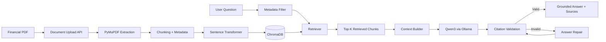

# FinResearch AI

[](https://github.com/teacuppp/finresearch-ai/actions/workflows/ci.yml)

**Entity-aware RAG platform for financial research.**

FinResearch AI ingests financial reports such as 10-K filings, converts them into searchable vector representations, performs metadata-aware semantic retrieval, and generates grounded financial answers with source citations.

The current version focuses on building the RAG stack from first principles rather than hiding the retrieval pipeline behind high-level agent frameworks.

## Overview

FinResearch AI supports a complete document-to-answer workflow:

1. Upload a financial PDF with structured metadata.
2. Extract and chunk document text with PyMuPDF.
3. Generate dense embeddings with Sentence Transformers.
4. Store chunks and metadata in ChromaDB.
5. Filter retrieval by company, ticker, fiscal year, or document type.
6. Retrieve the most relevant financial evidence.
7. Generate an answer using a local Qwen3 model through Ollama.
8. Validate citations and repair malformed LLM responses.
9. Refuse to answer when the retrieved evidence is insufficient.

## Key Features

* PDF ingestion with **PyMuPDF**
* Fixed-size chunking with overlap
* Sentence Transformer embeddings
* Persistent **ChromaDB** vector storage
* Multi-document financial corpus
* Metadata-aware retrieval using:

  * company
  * ticker
  * fiscal year
  * document type
* Entity-aware vector search
* Local **Qwen3** generation through Ollama
* Grounded answers restricted to retrieved context
* Source citations in `[Source N]` format
* Citation validation and one-step answer repair
* Safe refusal for unsupported questions
* Duplicate document replacement during re-indexing
* Shared application services through FastAPI lifespan
* Dependency injection for testable API components
* Automated pytest test suite
* FastAPI Swagger documentation

## Project Status

| Capability | Status |
|---|---|
| Multi-document indexing | ✅ Completed |
| Entity-aware metadata filtering | ✅ Completed |
| Duplicate document replacement | ✅ Completed |
| Ambiguous query detection | ✅ Completed |
| Grounded generation | ✅ Completed |
| Citation validation and repair | ✅ Completed |
| GitHub Actions CI | ✅ Completed |

Current focus: retrieval quality evaluation and optimization.

## Roadmap

- [ ] Retrieval evaluation with Hit@1, Hit@3, Hit@5, and MRR
- [ ] Improved financial-document chunking
- [ ] Hybrid retrieval and reranking
- [ ] Multilingual retrieval
- [ ] Structured LLM outputs
- [ ] SQL / Python analysis tools
- [ ] LangGraph agent workflows
- [ ] React frontend
- [ ] Docker and deployment

## Architecture



## Example

The same natural-language question can retrieve different financial evidence depending on metadata filters.

### Microsoft

Request:

```json
{
  "question": "What was total revenue in 2025?",
  "ticker": "MSFT",
  "fiscal_year": 2025,
  "top_k": 5
}
```

Response:

```json
{
  "answer": "Microsoft reported total revenue of $281.724 billion in 2025. [Source 2]"
}
```

### Apple

Request:

```json
{
  "question": "What was total revenue in 2025?",
  "ticker": "AAPL",
  "fiscal_year": 2025,
  "top_k": 5
}
```

Response:

```json
{
  "answer": "Apple reported total net sales of $416.161 billion in fiscal year 2025. [Source 2]"
}
```

This demonstrates entity-aware retrieval over a shared multi-document vector database.

## Tech Stack

| Layer                    | Technology                            |
| ------------------------ | ------------------------------------- |
| API                      | FastAPI                               |
| Language                 | Python 3.12                           |
| PDF processing           | PyMuPDF                               |
| Embeddings               | Sentence Transformers                 |
| Baseline embedding model | `all-MiniLM-L6-v2`                    |
| Vector database          | ChromaDB                              |
| Local LLM                | Qwen3                                 |
| Model runtime            | Ollama                                |
| LLM client               | OpenAI-compatible Python SDK          |
| Validation               | Pydantic + custom citation validation |
| Testing                  | pytest                                |

## API

### Health Check

```http
GET /health
```

### Upload and Index a Financial Document

```http
POST /documents/upload
```

The upload endpoint accepts:

* PDF file
* company
* ticker
* fiscal year
* document type

Example:

```bash
curl -X POST "http://127.0.0.1:8000/documents/upload" \
  -F "file=@annual-report.pdf" \
  -F "company=Microsoft" \
  -F "ticker=MSFT" \
  -F "fiscal_year=2025" \
  -F "document_type=10-K"
```

### Ask a Financial Question

```http
POST /rag/ask
```

Example:

```bash
curl -X POST "http://127.0.0.1:8000/rag/ask" \
  -H "Content-Type: application/json" \
  -d '{
    "question": "What was total revenue in 2025?",
    "ticker": "MSFT",
    "fiscal_year": 2025,
    "top_k": 5
  }'
```

## Getting Started

### 1. Clone the repository

```bash
git clone https://github.com/teacuppp/finresearch-ai.git
cd finresearch-ai
```

### 2. Create a virtual environment

```bash
python3 -m venv .venv
source .venv/bin/activate
```

### 3. Install dependencies

```bash
python -m pip install --upgrade pip
pip install -r requirements.txt
```

### 4. Install and prepare Ollama

Install Ollama, then download the local model:

```bash
ollama pull qwen3:4b
```

Make sure the Ollama service is running.

### 5. Start the API

```bash
uvicorn app.main:app --reload
```

Open Swagger UI:

```text
http://127.0.0.1:8000/docs
```

On the first run, Sentence Transformers may download the embedding model from Hugging Face.

## Project Structure

```text
finresearch-ai/
├── app/
│   ├── api/
│   │   ├── documents.py
│   │   ├── filters.py
│   │   └── rag.py
│   ├── rag/
│   │   ├── context.py
│   │   ├── embeddings.py
│   │   ├── generator.py
│   │   ├── ingestion.py
│   │   ├── models.py
│   │   ├── pipeline.py
│   │   ├── retriever.py
│   │   ├── splitter.py
│   │   ├── validation.py
│   │   └── vector_store.py
│   ├── services/
│   ├── dependencies.py
│   └── main.py
├── scripts/
├── tests/
├── requirements.txt
├── pytest.ini
└── README.md
```

## Testing

Run the complete test suite:

```bash
pytest
```

The tests cover document ingestion, chunking, embeddings, vector storage, metadata filtering, retrieval, RAG pipeline behavior, citation validation, answer repair, and FastAPI endpoints.

GitHub Actions runs the test suite automatically for pushes and pull requests targeting `main`.

## Engineering Decisions

### Explicit RAG Components

The retrieval pipeline is implemented through separate ingestion, embedding, vector-store, retrieval, context-building, generation, and validation layers. This keeps the underlying RAG mechanics visible and independently testable.

### Metadata-aware Retrieval

Financial documents are indexed with structured metadata such as ticker and fiscal year. Chroma metadata filters restrict the candidate corpus before semantic retrieval.

### Grounded Generation

The generator is instructed to answer only from retrieved evidence and refuse unsupported questions rather than fabricate financial values.

### Citation Guardrail

Generated factual answers must contain source citations. Invalid responses trigger a single repair attempt before the API returns a controlled error.

### Shared Model Lifecycle

Embedding models and shared services are initialized through FastAPI lifespan rather than being recreated for every HTTP request.

### Document Replacement

Re-indexing a document removes its previous vector records before inserting the new version, preventing stale chunks from remaining in the collection.

## Roadmap

* Ambiguous query detection across multiple companies
* Retrieval evaluation with Hit@1, Hit@3, Hit@5, and MRR
* Improved financial-document chunking
* Multilingual financial retrieval
* Hybrid retrieval and reranking
* Structured LLM outputs
* Financial market data tools
* SQL / Python analysis tools
* LangGraph agent workflows
* React frontend
* PostgreSQL / pgvector
* Docker and deployment

## Milestones

### v0.2.0 — Multi-document Entity-aware Retrieval

* Structured financial document metadata
* Metadata-aware Chroma retrieval
* Company / ticker / fiscal-year filtering
* FastAPI RAG endpoint
* Grounded generation with citations
* Citation repair and controlled failures
* Duplicate document replacement
* Automated tests

## Status

FinResearch AI is under active development.

The current focus is building a reliable and measurable financial RAG backend before introducing agentic workflows.
